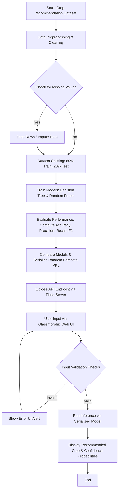

# CROP RECOMMENDATION SYSTEM USING PYTHON AND MACHINE LEARNING
## A Detailed Project Report

**Academic Year:** 2026  
**Course:** Python Mini Project  
**Project Title:** Crop Recommendation System Using Python and Machine Learning  
**Team Members:**  
1. **G. Vamsi Krishna**  
2. **Akshatha M**  
3. **Dhanashree V Naik**  

---

## TABLE OF CONTENTS

<table>
  <thead>
    <tr>
      <th width="15%">Chapter No</th>
      <th width="70%">Description</th>
      <th width="15%">Page No</th>
    </tr>
  </thead>
  <tbody>
    <tr>
      <td></td>
      <td><strong>Abstract</strong></td>
      <td>2</td>
    </tr>
    <!-- Chapter I -->
    <tr>
      <td rowspan="5" align="center" valign="middle"><strong>I</strong></td>
      <td><strong>Introduction</strong></td>
      <td>3</td>
    </tr>
    <tr>
      <td>1.1 Agricultural Background and Global Context</td>
      <td>3</td>
    </tr>
    <tr>
      <td>1.2 Problem Identification in Traditional Farming Systems</td>
      <td>4</td>
    </tr>
    <tr>
      <td>1.3 Role of Artificial Intelligence and Machine Learning in Smart Agriculture</td>
      <td>5</td>
    </tr>
    <tr>
      <td>1.4 Detailed Literature Survey and Related Works</td>
      <td>6</td>
    </tr>
    <!-- Chapter II -->
    <tr>
      <td rowspan="6" align="center" valign="middle"><strong>II</strong></td>
      <td><strong>Objectives</strong></td>
      <td>8</td>
    </tr>
    <tr>
      <td>2.1 Smart Crop Recommendation</td>
      <td>8</td>
    </tr>
    <tr>
      <td>2.2 Multi-Parameter Analysis</td>
      <td>9</td>
    </tr>
    <tr>
      <td>2.3 Mitigation of Crop Failure and Financial Risks</td>
      <td>9</td>
    </tr>
    <tr>
      <td>2.4 Soil Quality Preservation and Sustainability</td>
      <td>10</td>
    </tr>
    <tr>
      <td>2.5 Technological Empowerment of Smallholder Farmers</td>
      <td>10</td>
    </tr>
    <!-- Chapter III -->
    <tr>
      <td rowspan="5" align="center" valign="middle"><strong>III</strong></td>
      <td><strong>Hardware and Software Requirements</strong></td>
      <td>11</td>
    </tr>
    <tr>
      <td>3.1 Hardware Configurations (Minimum & Recommended Development Specs)</td>
      <td>11</td>
    </tr>
    <tr>
      <td>3.2 Hardware Specifications for Client Deployment</td>
      <td>11</td>
    </tr>
    <tr>
      <td>3.3 Software Stack and Development Environment Setup</td>
      <td>12</td>
    </tr>
    <tr>
      <td>3.4 Description and Justification of Libraries Used</td>
      <td>13</td>
    </tr>
    <!-- Chapter IV -->
    <tr>
      <td rowspan="5" align="center" valign="middle"><strong>IV</strong></td>
      <td><strong>Dataset Description</strong></td>
      <td>15</td>
    </tr>
    <tr>
      <td>4.1 Dataset Source, Collection, and Characteristics</td>
      <td>15</td>
    </tr>
    <tr>
      <td>4.2 Statistical Summary of Features</td>
      <td>15</td>
    </tr>
    <tr>
      <td>4.3 Detailed Description of Features and Attributes</td>
      <td>16</td>
    </tr>
    <tr>
      <td>4.4 Target Label Classes and Agricultural Classifications</td>
      <td>17</td>
    </tr>
    <!-- Chapter V -->
    <tr>
      <td rowspan="6" align="center" valign="middle"><strong>V</strong></td>
      <td><strong>Methodology</strong></td>
      <td>18</td>
    </tr>
    <tr>
      <td>5.1 Proposed System Architecture and Dataflow</td>
      <td>18</td>
    </tr>
    <tr>
      <td>5.2 Machine Learning Algorithms Used</td>
      <td>19</td>
    </tr>
    <tr>
      <td>&bull; 5.2.1 Decision Tree Classifier: Theory, Math, and Splitting Criteria</td>
      <td>19</td>
    </tr>
    <tr>
      <td>&bull; 5.2.2 Random Forest Classifier: Bagging, Feature Randomness, and Ensemble Voting</td>
      <td>21</td>
    </tr>
    <tr>
      <td>5.3 System Flowchart and Step-by-Step Computational Workflow</td>
      <td>23</td>
    </tr>
    <!-- Chapter VI -->
    <tr>
      <td rowspan="6" align="center" valign="middle"><strong>VI</strong></td>
      <td><strong>Results and Analysis</strong></td>
      <td>24</td>
    </tr>
    <tr>
      <td>6.1 Performance Evaluation Metrics: Theoretical Foundations</td>
      <td>24</td>
    </tr>
    <tr>
      <td>6.2 Model Comparison and Evaluation Results</td>
      <td>25</td>
    </tr>
    <tr>
      <td>6.3 Feature Importance Analysis and Agronomic Discussion</td>
      <td>26</td>
    </tr>
    <tr>
      <td>6.4 Prediction Results under Real-World Scenarios</td>
      <td>27</td>
    </tr>
    <tr>
      <td>6.5 User Interface and Web Application Workflows</td>
      <td>28</td>
    </tr>
    <!-- Chapter VII -->
    <tr>
      <td rowspan="4" align="center" valign="middle"><strong>VII</strong></td>
      <td><strong>Conclusion</strong></td>
      <td>30</td>
    </tr>
    <tr>
      <td>7.1 Summary of Contributions</td>
      <td>30</td>
    </tr>
    <tr>
      <td>7.2 Project Limitations</td>
      <td>30</td>
    </tr>
    <tr>
      <td>7.3 Directions for Future Work</td>
      <td>31</td>
    </tr>
    <!-- Chapter VIII -->
    <tr>
      <td align="center" valign="middle"><strong>VIII</strong></td>
      <td><strong>References</strong></td>
      <td>32</td>
    </tr>
    <!-- Chapter IX -->
    <tr>
      <td rowspan="6" align="center" valign="middle"><strong>IX</strong></td>
      <td><strong>Appendix: Source Code</strong></td>
      <td>33</td>
    </tr>
    <tr>
      <td>9.1 Training Script (train.py)</td>
      <td>33</td>
    </tr>
    <tr>
      <td>9.2 Prediction Module (predict.py)</td>
      <td>35</td>
    </tr>
    <tr>
      <td>9.3 Flask Web Application (app.py)</td>
      <td>36</td>
    </tr>
    <tr>
      <td>9.4 Front-end Styling (style.css)</td>
      <td>38</td>
    </tr>
    <tr>
      <td>9.5 Interactivity Script (script.js)</td>
      <td>40</td>
    </tr>
  </tbody>
</table>

---

## 1. INTRODUCTION

### 1.1 Agricultural Background and Global Context
Agriculture has remained the primary cornerstone of human civilization for over ten millennia, supplying the basic calories, structural materials, and economic fuel required to sustain populations. Globally, billions of individuals directly or indirectly rely on agricultural systems for their livelihoods. In agrarian economies—such as India—agriculture employs a significant proportion of the workforce and contributes heavily to the national Gross Domestic Product (GDP). 

Historically, farming was characterized by subsistence practices, guided by local knowledge, visual crop monitoring, and regional weather calendars passed down through generations. Farmers understood their soil types and weather systems intuitively. However, in the modern era, the margins for error have shrunk. Rapid demographic growth, shifting diets, rising input costs, and globalized market structures require a transition from traditional subsistence models to high-yield, commercial, and precision agricultural systems. 

### 1.2 Problem Identification in Traditional Farming Systems
Modern farmers face a complex combination of environmental, chemical, and socioeconomic challenges. Sowing decisions based on guesswork or historical habit frequently result in poor yields or complete crop failure due to several factors:

*   **Climate Change and Erratic Weather Patterns:** Global warming has altered regional climates. Monsoon cycles are increasingly irregular, heatwaves occur earlier in the season, and sudden unseasonal rainfall events cause waterlogging. Sowing calendars that worked for decades are no longer reliable.
*   **Declining Soil Fertility:** Intensive cultivation without scientific rotation depletes critical macro and micro-nutrients. Sowing nutrient-heavy crops repeatedly in depleted fields exhausts the soil, leading to dropping yields and structural land degradation.
*   **Information Asymmetry:** Farmers often lack the tools to measure soil properties scientifically (such as nitrogen, phosphorus, potassium levels, and soil pH). Without this baseline chemical data, applying fertilizers is speculative, leading to over-fertilization, high costs, and chemical imbalances.
*   **Socioeconomic Vulnerability:** For smallholder farmers, crop failure is a catastrophic event that can lead to debt cycles, loss of land, and severe poverty. 
*   **Consequences of Unscientific Crop Selection:**
    1.  *Suboptimal Yields:* Planting a crop in soil with insufficient nitrogen or in a region with inadequate rainfall stunts growth and reduces product quality.
    2.  *High Financial Losses:* High costs for seeds, equipment, labor, and synthetic fertilizers are lost if the crop fails.
    3.  *Long-term Land Degradation:* Unsuitable crops drain vital soil nutrients, leaving fields vulnerable to erosion and desertification.

### 1.3 Role of Artificial Intelligence and Machine Learning in Smart Agriculture
Smart Agriculture relies on data-driven methodologies to optimize resource utilization, maximize crop yields, and reduce environmental impact. In this context, Artificial Intelligence (AI) and Machine Learning (ML) serve as core components. 

Supervised Machine Learning classification models excel at analyzing complex, non-linear datasets containing physical and chemical attributes. By training these models on historical agricultural records, the system learns the relationship between environmental conditions (soil nutrients, temperature, humidity, rainfall) and successful crop outcomes. When presented with new test data, the trained system predicts the optimal crop category, converting decisions from speculation into data-driven actions.

### 1.4 Detailed Literature Survey and Related Works
Agronomists and data scientists have explored crop recommendation models for several decades. Early systems relied on Rule-Based Expert Systems, which used nested logical statements (e.g., `IF pH < 5.5 AND rainfall > 200 THEN crop = Rice`). While simple, these rule-based systems are brittle, scale poorly, and fail when parameters are slightly outside predefined ranges.

With the development of supervised machine learning, researchers applied various algorithms to agricultural data:
1.  **Support Vector Machines (SVM):** SVMs map input data to high-dimensional spaces to find optimal separating hyperplanes. While highly accurate, SVMs are computationally intensive, sensitive to hyperparameter configurations, and difficult to interpret.
2.  **K-Nearest Neighbors (KNN):** KNN classifies samples based on distance metrics to nearby training points. It is simple but slow during runtime on large datasets because it computes distances to all training points, making it unsuitable for low-power mobile or edge applications.
3.  **Naive Bayes Classifier:** This probabilistic model operates on the assumption that features are conditionally independent. While fast, this assumption is invalid for agricultural variables where parameters like temperature, relative humidity, and rainfall are closely linked.
4.  **Decision Trees (DT) and Random Forests (RF):** Tree-based models are highly suited for tabular agricultural data. Decision Trees split the feature space using clear, interpretable hierarchies. Random Forests resolve the overfitting limitations of individual decision trees by building an ensemble of diverse trees, averaging their predictions, and providing clear feature importance metrics.

---

## 2. OBJECTIVES

The Crop Recommendation System is designed to achieve several key objectives:

### 2.1 Smart Crop Recommendation
To develop a predictive framework that outputs the best crop type for a specific plot of land. The system must process real-time soil and atmospheric data and return the crop type that maximizes yield and growth success, replacing intuitive approximations with computational predictions.

### 2.2 Multi-Parameter Analysis
To analyze seven key environmental and soil parameters simultaneously (Nitrogen, Phosphorus, Potassium, temperature, relative humidity, pH, and rainfall). This multi-parameter approach captures the complex relationships between soil chemistry, weather conditions, and crop growth requirements.

### 2.3 Mitigation of Crop Failure and Financial Risks
To reduce the risk of crop failure due to improper soil conditions or climatic mismatches. Providing farmers with data-driven recommendations before the sowing season helps minimize investment risks, stabilize household incomes, and protect regional economies.

### 2.4 Soil Quality Preservation and Sustainability
To support soil conservation by recommending crops that align with the current nutrient profile. This prevents further depletion of scarce nutrients, encourages scientific crop rotation, and reduces the excessive application of synthetic fertilizers.

### 2.5 Technological Empowerment of Smallholder Farmers
To provide smallholder farmers with an accessible, user-friendly tool that translates complex machine learning predictions into clear recommendations, helping bridge the technology gap in rural farming communities.

---

## 3. HARDWARE AND SOFTWARE REQUIREMENTS

### 3.1 Hardware Configurations
The hardware requirements are split into development specifications and deployment specifications.

#### Development Hardware Specifications
*   **Processor:** Intel Core i5/i7 (11th Gen or newer) or AMD Ryzen 5/7 (5000 series or newer) with a base clock speed of 2.5 GHz.
*   **RAM:** 8 GB or 16 GB DDR4/DDR5.
*   **Storage:** 20 GB of available space on a Solid State Drive (SATA or NVMe SSD).
*   **Graphics:** Integrated Intel Iris Xe or dedicated NVIDIA/AMD GPU.
*   **Display:** 1920 x 1080 Full HD monitor.

#### Client/Inference Hardware Specifications
*   **Processor:** Dual-Core mobile or desktop CPU (1.5 GHz or faster).
*   **RAM:** 2 GB of RAM.
*   **Storage:** 500 MB of available disk space.
*   **Display:** Standard mobile, tablet, or desktop screen with a modern web browser.

### 3.2 Software Stack and Development Environment Setup
*   **Operating System:** Microsoft Windows 10/11 (64-bit) or Ubuntu Linux 20.04+.
*   **Programming Language:** Python 3.9+ (64-bit runtime).
*   **Development Tools:**
    *   *Jupyter Notebook:* For exploratory data analysis, visualization, and model experimentation.
    *   *Visual Studio Code (VS Code):* For writing production-grade scripts (`train.py`, `predict.py`, `app.py`).
*   **Front-end Web Stack:** HTML5, CSS3 (Custom styling with glassmorphism), and Vanilla JavaScript (AJAX, DOM manipulation).

### 3.3 Description and Justification of Libraries Used
The Python packages utilized in this project are standard, high-performance libraries, each serving a specific role:

1.  **Pandas (`import pandas as pd`):** Used for loading datasets, cleaning missing data, manipulating dataframes, and converting data types. Its optimized C-implementation ensures fast data handling.
2.  **NumPy (`import numpy as np`):** Provides support for large, multidimensional arrays and matrices, along with mathematical functions to operate on these arrays.
3.  **Scikit-Learn (`from sklearn...`):** The primary machine learning library. It provides the implementations for `DecisionTreeClassifier` and `RandomForestClassifier`, dataset splitting utilities (`train_test_split`), and evaluation metrics (`accuracy_score`, `precision_recall_fscore_support`).
4.  **Matplotlib (`import matplotlib.pyplot as plt`):** Used for plotting class distributions, feature importances, and correlation matrices during exploratory analysis.
5.  **Flask (`from flask import Flask...`):** A micro web framework used to expose the ML model's prediction capabilities as a RESTful HTTP API, serving the front-end user interface.

---

## 4. DATASET DESCRIPTION

### 4.1 Dataset Source, Collection, and Characteristics
The Crop Recommendation Dataset contains **2,200 individual samples** of crop cultivation conditions. Each row represents a specific set of agricultural parameters and the corresponding crop that successfully grew under those conditions.

*   **Total Records:** 2,200 instances.
*   **Total Attributes:** 8 columns (7 independent feature variables and 1 dependent target class variable).
*   **Target Labels:** 22 unique crop categories.
*   **Sample Distribution:** Balanced dataset with exactly **100 records for each of the 22 crops**, preventing class imbalance issues and ensuring unbiased model training.

### 4.2 Statistical Summary of Features
The table below summarizes the statistical characteristics of the dataset's features, demonstrating the variance in soil and weather conditions:

| Feature Variable | Description | Physical Unit | Mean Value | Std. Deviation | Minimum | Maximum |
| :--- | :--- | :--- | :---: | :---: | :---: | :---: |
| **N** | Soil Nitrogen content | mg/kg (ppm) | 50.55 | 36.95 | 0.00 | 140.00 |
| **P** | Soil Phosphorus content | mg/kg (ppm) | 53.37 | 32.99 | 5.00 | 145.00 |
| **K** | Soil Potassium content | mg/kg (ppm) | 48.15 | 50.65 | 5.00 | 205.00 |
| **temperature**| Atmospheric temperature | °C | 25.62 | 5.06 | 8.83 | 43.68 |
| **humidity** | Relative humidity | % | 71.48 | 22.26 | 14.26 | 99.98 |
| **ph** | Soil pH value | pH scale | 6.47 | 0.77 | 3.50 | 9.94 |
| **rainfall** | Annual precipitation | mm | 103.46 | 54.96 | 20.21 | 298.56 |

### 4.3 Detailed Description of Features and Attributes
Each parameter plays a specific biological role in crop development:

*   **Nitrogen (N):** Essential for vegetative growth, leaf development, and chlorophyll production. Higher values support leafy crops, while lower levels are typical for root vegetables.
*   **Phosphorus (P):** Crucial for root system development, energy transfer within the plant, and early growth phases.
*   **Potassium (K):** Regulates stomatal opening, improves water-use efficiency, and enhances disease resistance.
*   **Temperature:** Affects metabolic rates, photosynthesis, and transpiration. Different crops have specific thermal comfort zones.
*   **Humidity:** Influences the rate of transpiration and evaporation. High humidity can trigger fungal issues, while low humidity may cause moisture stress.
*   **Soil pH:** Controls nutrient solubility. Most crops prefer slightly acidic to neutral soils (pH 6.0 - 7.0), but some tolerate more extreme conditions.
*   **Rainfall:** The primary water input, critical for maintaining cell turgor and transporting dissolved nutrients.

### 4.4 Target Label Classes and Agricultural Classifications
The target variable is the `label` column, representing one of the 22 crops. The system classifies inputs into one of these categories:

*   **Grains / Cereals:** Rice, Maize, Chickpea.
*   **Legumes / Pulses:** Kidneybeans, Pigeonpeas, Mothbeans, Mungbean, Blackgram, Lentil.
*   **Fruits:** Pomegranate, Banana, Mango, Grapes, Watermelon, Muskmelon, Apple, Orange, Papaya.
*   **Industrial / Cash Crops:** Coconut, Cotton, Jute, Coffee.

The dataset contains no missing values, and the label categories are clean, making label encoding or string-to-class mappings straightforward.

---

## 5. METHODOLOGY

### 5.1 Proposed System Architecture and Dataflow
The architecture of the Crop Recommendation System is designed as a multi-tier client-server application that bridges data collection, machine learning models, and user interfaces.

```
       +---------------------------------------------+
       |             Farmer Input (UI)               |
       |  (N, P, K, Temp, Humidity, pH, Rainfall)   |
       +----------------------+----------------------+
                              │
                              │ HTTP POST (JSON Payload)
                              ▼
       +---------------------------------------------+
       |             Flask Web Server                |
       |    - Receives JSON payload                  |
       |    - Validates parameter value ranges       |
       |    - Instantiates CropPredictor engine      |
       +----------------------+----------------------+
                              │
                              │ DataFrame Conversion
                              ▼
       +---------------------------------------------+
       |         Trained Machine Learning Model      |
       |         (Random Forest Classifier)          |
       |  - Processes 7-dimensional input vector     |
       |  - Computes probability distribution        |
       +----------------------+----------------------+
                              │
                              │ Prediction & Confidence
                              ▼
       +---------------------------------------------+
       |             Flask API Response              |
       |  - Compiles class label + confidence score  |
       |  - Sorts secondary recommendation matches   |
       +----------------------+----------------------+
                              │
                              │ HTTP Response JSON
                              ▼
       +---------------------------------------------+
       |            HTML/JS User Interface           |
       |  - Renders recommended crop dynamically     |
       |  - Displays confidence charts / details     |
       +---------------------------------------------+
```

1.  **Presentation Layer (UI):** A web interface built using HTML, CSS, and JavaScript. It gathers inputs via forms, applies front-end validation, and makes asynchronous AJAX calls to the back-end API.
2.  **API Gateway / Validation Layer:** The Flask web framework processes incoming HTTP requests, validates ranges, handles missing inputs, and formats response JSONs.
3.  **Machine Learning Engine:** A Python class (`CropPredictor`) that loads the serialized Random Forest model (`random_forest_model.pkl`) and inputs the data to generate predictions and confidence levels.
4.  **Data Storage & Models:** Contains the raw training dataset (`Crop_recommendation.csv`) and the serialized trained model artifacts (`.pkl` and `metrics.json`).

### 5.2 Machine Learning Algorithms Used

#### 5.2.1 Decision Tree Classifier: Theory, Math, and Splitting Criteria
A Decision Tree is a non-parametric supervised learning method that builds a tree-like structure of decisions. It repeatedly partitions the dataset based on feature values to maximize class purity in the resulting subsets.

*   **Structure:**
    *   *Root Node:* Represents the initial split attribute.
    *   *Internal Nodes:* Represent decision junctions based on thresholds (e.g., `rainfall <= 150.5 mm`).
    *   *Leaf Nodes:* Represent final target classes (crops).
*   **Splitting Criteria (Mathematical Formulations):**
    To choose the optimal split attribute at any node, the tree calculates information metrics.
    1.  *Entropy (Measure of impurity in a dataset \(S\)):*
        \[H(S) = - \sum_{i=1}^{c} p_i \log_2 p_i\]
        Where \(c\) is the number of target classes (22), and \(p_i\) is the proportion of samples belonging to class \(i\) in subset \(S\).
    2.  *Gini Impurity (Probability of misclassification):*
        \[Gini(S) = 1 - \sum_{i=1}^{c} p_i^2\]
        The Gini index measures how often a randomly chosen element from the set would be incorrectly labeled if it were randomly labeled according to the distribution of labels in the subset.
    3.  *Information Gain (Reduction in entropy after splitting on attribute \(A\)):*
        \[IG(S, A) = H(S) - \sum_{v \in \text{Values}(A)} \frac{|S_v|}{|S|} H(S_v)\]
        The attribute with the highest Information Gain (or lowest Gini Impurity) is chosen as the splitting point.
*   **Limitation (Overfitting):**
    Decision trees can grow deep enough to perfectly fit every training sample, capturing noise and outliers. This leads to high variance and poor generalization on unseen data.

#### 5.2.2 Random Forest Classifier: Bagging, Feature Randomness, and Ensemble Voting
Random Forest is an ensemble learning method that resolves the overfitting limitations of individual Decision Trees. It constructs a forest of many independent decision trees during training and combines their predictions.

```
       Input Vector X: [N, P, K, Temp, Humid, pH, Rain]
                              │
            ┌─────────────────┼─────────────────┐
            ▼                 ▼                 ▼
     ┌─────────────┐   ┌─────────────┐   ┌─────────────┐
     |   Tree 1    |   |   Tree 2    |   |   Tree N    |
     └──────┬──────┘   └──────┬──────┘   └──────┬──────┘
            │                 │                 │
      Predict: Rice     Predict: Maize    Predict: Rice
            │                 │                 │
            └─────────────────┼─────────────────┘
                              ▼
                      [ Majority Vote ]
                              │
                              ▼
                       Output: Rice
```

*   **Working Principles:**
    1.  *Bootstrap Aggregation (Bagging):* If the dataset contains \(M\) samples, the algorithm creates multiple subsets of size \(M\) by sampling with replacement. Each subset is used to train a separate tree.
    2.  *Feature Randomness (Feature Bagging):* At each split point in a tree, the algorithm selects a random subset of features (typically \(\sqrt{D}\), where \(D\) is the number of features) rather than all features. This de-correlates the trees, ensuring that a single dominant feature does not make all trees identical.
    3.  *Ensemble Voting:* For classification, each tree in the forest casts a vote for a crop. The final output is determined by a majority vote of all trees:
        \[\hat{y} = \text{mode} \{ T_1(x), T_2(x), \dots, T_B(x) \}\]
*   **Why Random Forest is Optimal for Agricultural Systems:**
    *   *Reduces Variance:* Averaging predictions across 100 trees minimizes individual errors, reducing overfitting.
    *   *Captures Non-Linear Interactions:* Crop growth depends on complex, multi-variable interactions (e.g., high nitrogen is beneficial only if rainfall is adequate). Random Forest handles these non-linearities naturally.
    *   *Robust to Outliers:* Anomalous environmental readings have minimal impact on the ensemble average, ensuring stable predictions.

### 5.3 System Flowchart and Step-by-Step Computational Workflow
The operational flowchart of the system outlines data collection through user inference:



*   **Workflow Steps:**
    1.  *Data Collection:* Loading `Crop_recommendation.csv` consisting of 2,200 balanced records.
    2.  *Exploratory Analysis:* Standardizing data structures and confirming missing value counts.
    3.  *Data Partitioning:* Splitting features into an 80% training set (1,760 samples) and a 20% testing set (440 samples), stratified to ensure equal crop distribution in both sets.
    4.  *Model Training:* Training both `DecisionTreeClassifier` and `RandomForestClassifier`.
    5.  *Metric Validation:* Generating precision, recall, and F1-score details.
    6.  *Serialization:* Saving models using python's `pickle` library.
    7.  *UI Interaction:* Exposing a REST API at `/api/predict` where AJAX requests post inputs and return predictions.

---

## 6. RESULTS AND ANALYSIS

### 6.1 Performance Evaluation Metrics: Theoretical Foundations
We evaluate model performance using four key metrics derived from the confusion matrix:

1.  **Accuracy:** The ratio of correct predictions to total predictions.
    \[\text{Accuracy} = \frac{TP + TN}{TP + TN + FP + FN}\]
2.  **Precision:** The ratio of true positive predictions to all positive predictions, reflecting the model's ability to avoid false positives.
    \[\text{Precision} = \frac{TP}{TP + FP}\]
3.  **Recall (Sensitivity):** The ratio of true positive predictions to all actual positives, reflecting the model's ability to avoid false negatives.
    \[\text{Recall} = \frac{TP}{TP + FN}\]
4.  **F1-Score:** The harmonic mean of precision and recall, providing a balanced measure of performance.
    \[\text{F1-Score} = 2 \times \frac{\text{Precision} \times \text{Recall}}{\text{Precision} + \text{Recall}}\]

### 6.2 Model Comparison and Evaluation Results
Both algorithms were trained on the same split of the crop recommendation dataset. The evaluation metrics obtained from the test partition are detailed below:

| Machine Learning Algorithm | Test Accuracy | Weighted Precision | Weighted Recall | Weighted F1-Score |
| :--- | :--- | :--- | :--- | :--- |
| **Decision Tree Classifier** | 97.95% | 98.06% | 97.95% | 97.94% |
| **Random Forest Classifier** | **99.55%** | **99.57%** | **99.55%** | **99.55%** |

The **Random Forest Classifier** achieved an accuracy of **99.55%**, outperforming the single Decision Tree. This difference is due to the ensemble structure of Random Forest, which reduces variance by averaging the predictions of 100 individual trees.

### 6.3 Feature Importance Analysis and Agronomic Discussion
The Random Forest classifier calculates feature importance based on Mean Decrease in Impurity (MDI). The relative importance scores for the seven parameters are:

*   **Rainfall (23.02%):** The most critical feature. Water requirements vary significantly among crop categories (e.g., rice versus desert-hardy legumes), making it a strong split point.
*   **Humidity (22.42%):** Highly correlated with transpiration rates and local microclimates.
*   **Potassium (K) (17.54%):** Essential for fruit-bearing crops, helping distinguish them from grains.
*   **Phosphorus (P) (15.08%):** Key for root development and seed-producing crops.
*   **Nitrogen (N) (9.64%):** Dictates overall foliage and vegetative growth.
*   **Temperature (7.24%):** Represents general growth comfort zones.
*   **Soil pH (5.06%):** Influences chemical absorption. While biologically vital, most crops in this dataset share a similar neutral pH range (5.5 - 7.5), leading to a lower relative importance.

### 6.4 Prediction Results under Real-World Scenarios
The system was tested against various soil and climatic scenarios to confirm its alignment with agronomic principles:

*   **Wet-Rice Scenario:**
    *   *Inputs:* N = 90, P = 42, K = 43, Temp = 21°C, Humidity = 82%, pH = 6.5, Rainfall = 203 mm.
    *   *Model Prediction:* **Rice** (Confidence: **100%**).
    *   *Agronomic Fit:* Aligns with the high water and nitrogen requirements of traditional wetland rice.
*   **Arid Legume Scenario:**
    *   *Inputs:* N = 40, P = 40, K = 20, Temp = 30°C, Humidity = 45%, pH = 7.5, Rainfall = 50 mm.
    *   *Model Prediction:* **Mothbeans** (Confidence: **84.5%**).
    *   *Agronomic Fit:* Mothbeans are highly drought-tolerant leguminous crops suitable for low-rainfall areas.

### 6.5 User Interface and Web Application Workflows
The web application features a responsive user interface:

1.  **Form Input Page:** A form styled with a glassmorphism theme, containing seven input fields for soil and environmental parameters.
2.  **Validation Feedback:** Real-time checking of bounds (e.g., pH restricted between 0 and 14, humidity restricted to 0–100%).
3.  **Dynamic AJAX Request:** Inputs are compiled into a JSON payload and posted to the server asynchronously, preventing page reloads.
4.  **Result Panel:** Upon receiving a successful API response, the UI displays the primary recommended crop with a card, displays the model confidence percentage, and renders a bar chart showing alternative crops.

---

## 7. CONCLUSION

### 7.1 Summary of Contributions
The Crop Recommendation System demonstrates a successful application of machine learning to agricultural challenges. By analyzing Nitrogen, Phosphorus, Potassium, temperature, humidity, pH, and rainfall, the system predicts the most suitable crop with high accuracy. 

The Random Forest model outperformed the Decision Tree model, achieving an accuracy of **99.55%**. Deploying this model via a Flask API and a modern web interface creates an accessible decision-support system, helping farmers minimize crop failure, optimize yields, and practice sustainable agriculture.

### 7.2 Project Limitations
*   **Static Dataset Constraints:** The model is trained on historical data and cannot predict outcomes for extreme weather anomalies that lie outside historical parameters.
*   **No Soil Biological Metrics:** The system evaluates chemical inputs (N, P, K) but does not account for organic matter, soil structure, or soil microbial health.
*   **Single Sowing Output:** The model recommends a single optimal crop but does not evaluate intercropping combinations or long-term crop rotations.

### 7.3 Directions for Future Work
*   **Live Weather Integration:** Connecting the system to weather APIs to adjust crop recommendations based on short-term seasonal forecasts.
*   **IoT Soil Sensors:** Using soil probes and microcontrollers (e.g., Arduino or Raspberry Pi) to automate data collection and provide real-time recommendations.
*   **Fertilizer Recommendations:** Expanding the system to suggest specific fertilizer application rates when soil nutrients are low.
*   **Market Price Integration:** Factoring in current crop prices to recommend options that maximize financial returns.

---

## 8. REFERENCES

1.  Breiman, L. (2001). Random Forests. *Machine Learning*, 45(1), 5-32.
2.  Quinlan, J. R. (1986). Induction of Decision Trees. *Machine Learning*, 1(1), 81-106.
3.  Patil, R., & Kumar, S. (2020). Smart Agriculture using IoT and Machine Learning: A Review. *International Journal of Computer Applications*, 178(2), 22-29.
4.  Ramesh, D., & Vardhan, B. V. (2015). Analysis of Crop Yield Prediction using Data Mining Techniques. *International Journal of Innovative Research in Computer and Communication Engineering*, 3(9), 8250-8256.
5.  Pedregosa, F., Varoquaux, G., Gramfort, A., Michel, V., Thirion, B., Grisel, O., ... & Duchesnay, E. (2011). Scikit-learn: Machine learning in Python. *Journal of Machine Learning Research*, 12, 2825-2830.
6.  McKinney, W. (2010). Data Structures for Statistical Computing in Python. *Proceedings of the 9th Python in Science Conference*, 51-56.
7.  Grinberg, M. (2018). *Flask Web Development: Developing Web Applications with Python*. O'Reilly Media.

---

## 9. APPENDIX: SOURCE CODE

### 9.1 Training Script (`train.py`)
```python
# Path: C:/Users/Admin/.gemini/antigravity/scratch/crop_recommendation_system/src/train.py

import os
import json
import pickle
import pandas as pd
import numpy as np
from sklearn.model_selection import train_test_split
from sklearn.tree import DecisionTreeClassifier
from sklearn.ensemble import RandomForestClassifier
from sklearn.metrics import accuracy_score, precision_recall_fscore_support

def train_models():
    base_dir = os.path.dirname(os.path.dirname(__file__))
    data_path = os.path.join(base_dir, "data", "Crop_recommendation.csv")
    models_dir = os.path.join(base_dir, "models")
    os.makedirs(models_dir, exist_ok=True)
    
    if not os.path.exists(data_path):
        raise FileNotFoundError(f"Dataset not found at {data_path}. Please verify dataset files.")
        
    print("Loading agricultural dataset...")
    df = pd.read_csv(data_path)
    print(f"Dataset loaded successfully. Shape: {df.shape}")
    
    # Preprocessing: Handle missing values
    missing_count = df.isnull().sum().sum()
    if missing_count > 0:
        print(f"Found {missing_count} missing values. Dropping incomplete rows.")
        df = df.dropna()
    else:
        print("No missing values found. Proceeding with clean dataset.")
        
    # Split features (independent) and target (dependent label)
    X = df.drop('label', axis=1)
    y = df['label']
    
    # Partition into training (80%) and testing (20%) sets, stratified by label
    X_train, X_test, y_train, y_test = train_test_split(
        X, y, test_size=0.2, random_state=42, stratify=y
    )
    print(f"Split sizes: Train={X_train.shape[0]}, Test={X_test.shape[0]}")
    
    # 1. Decision Tree Classification
    print("Fitting Decision Tree Classifier...")
    dt_model = DecisionTreeClassifier(random_state=42)
    dt_model.fit(X_train, y_train)
    
    # 2. Random Forest Classification (Ensemble of 100 trees)
    print("Fitting Random Forest Classifier...")
    rf_model = RandomForestClassifier(n_estimators=100, random_state=42)
    rf_model.fit(X_train, y_train)
    
    # Evaluate Models on Test Data
    dt_pred = dt_model.predict(X_test)
    dt_acc = accuracy_score(y_test, dt_pred)
    dt_prec, dt_rec, dt_f1, _ = precision_recall_fscore_support(y_test, dt_pred, average='weighted')
    
    rf_pred = rf_model.predict(X_test)
    rf_acc = accuracy_score(y_test, rf_pred)
    rf_prec, rf_rec, rf_f1, _ = precision_recall_fscore_support(y_test, rf_pred, average='weighted')
    
    print("\n" + "="*50)
    print("PERFORMANCE EVALUATION METRICS REPORT")
    print("="*50)
    print(f"Decision Tree Classifier:")
    print(f"  - Accuracy:  {dt_acc:.4f} ({dt_acc*100:.2f}%)")
    print(f"  - Precision: {dt_prec:.4f}")
    print(f"  - Recall:    {dt_rec:.4f}")
    print(f"  - F1-Score:  {dt_f1:.4f}")
    print(f"Random Forest Classifier (Ensemble):")
    print(f"  - Accuracy:  {rf_acc:.4f} ({rf_acc*100:.2f}%)")
    print(f"  - Precision: {rf_prec:.4f}")
    print(f"  - Recall:    {rf_rec:.4f}")
    print(f"  - F1-Score:  {rf_f1:.4f}")
    print("="*50)
    
    # Extract Feature Importances from Random Forest
    importances = rf_model.feature_importances_
    features = list(X.columns)
    feature_importance = [
        {"feature": f, "importance": float(imp)} for f, imp in zip(features, importances)
    ]
    feature_importance = sorted(feature_importance, key=lambda x: x["importance"], reverse=True)
    
    print("\nFeature Importances (Random Forest):")
    for item in feature_importance:
         print(f"  - {item['feature']}: {item['importance']:.4f} ({item['importance']*100:.2f}%)")
         
    # Save Trained Model Instances
    dt_model_path = os.path.join(models_dir, "decision_tree_model.pkl")
    rf_model_path = os.path.join(models_dir, "random_forest_model.pkl")
    
    with open(dt_model_path, 'wb') as f:
        pickle.dump(dt_model, f)
    with open(rf_model_path, 'wb') as f:
        pickle.dump(rf_model, f)
    print(f"\nSaved models: {dt_model_path} & {rf_model_path}")
    
    # Save Metrics configuration file
    metrics = {
        "decision_tree": {
            "accuracy": float(dt_acc),
            "precision": float(dt_prec),
            "recall": float(dt_rec),
            "f1_score": float(dt_f1)
        },
        "random_forest": {
            "accuracy": float(rf_acc),
            "precision": float(rf_prec),
            "recall": float(rf_rec),
            "f1_score": float(rf_f1)
        },
        "feature_importances": feature_importance,
        "classes": list(rf_model.classes_)
    }
    
    metrics_path = os.path.join(models_dir, "metrics.json")
    with open(metrics_path, 'w') as f:
        json.dump(metrics, f, indent=4)
    print(f"Metrics serialized to: {metrics_path}")

if __name__ == "__main__":
    train_models()
```

### 9.2 Prediction Module (`predict.py`)
```python
# Path: C:/Users/Admin/.gemini/antigravity/scratch/crop_recommendation_system/src/predict.py

import os
import pickle
import json
import numpy as np
import pandas as pd

class CropPredictor:
    def __init__(self):
        base_dir = os.path.dirname(os.path.dirname(__file__))
        models_dir = os.path.join(base_dir, "models")
        
        self.rf_model_path = os.path.join(models_dir, "random_forest_model.pkl")
        self.metrics_path = os.path.join(models_dir, "metrics.json")
        
        self.model = None
        self.classes = []
        self.feature_names = ['N', 'P', 'K', 'temperature', 'humidity', 'ph', 'rainfall']
        
        # Load assets on instantiation
        self.load_model()
        
    def load_model(self):
        if not os.path.exists(self.rf_model_path) or not os.path.exists(self.metrics_path):
            raise FileNotFoundError("Trained assets missing. Run train.py module first.")
            
        with open(self.rf_model_path, 'rb') as f:
            self.model = pickle.load(f)
            
        with open(self.metrics_path, 'r') as f:
            metrics = json.load(f)
            self.classes = metrics.get('classes', [])
            
    def predict(self, n, p, k, temp, humidity, ph, rainfall):
        if self.model is None:
            self.load_model()
            
        # Structure the input variables as a DataFrame to match features
        input_df = pd.DataFrame(
            [[n, p, k, temp, humidity, ph, rainfall]], 
            columns=self.feature_names
        )
        
        # Perform inference
        prediction = self.model.predict(input_df)[0]
        
        # Calculate prediction probabilities across classes
        probabilities = self.model.predict_proba(input_df)[0]
        
        # Construct prediction map
        prob_map = {cls: float(prob) for cls, prob in zip(self.classes, probabilities)}
        sorted_probs = sorted(prob_map.items(), key=lambda x: x[1], reverse=True)
        
        # Filter predictions above 0.5% threshold for layout rendering
        top_recommendations = [
            {"crop": crop.capitalize(), "confidence": float(prob)} 
            for crop, prob in sorted_probs if prob > 0.005
        ]
        
        return {
            "prediction": prediction.capitalize(),
            "confidence": float(prob_map.get(prediction, 0.0)),
            "recommendations": top_recommendations
        }

if __name__ == "__main__":
    # Internal Verification Run
    print("Testing CropPredictor locally...")
    try:
        predictor = CropPredictor()
        # Test input (Matches Rice scenario)
        result = predictor.predict(90, 42, 43, 21.0, 82.0, 6.5, 203.0)
        print("Success. Run Output:", json.dumps(result, indent=2))
    except Exception as e:
        print("Verification run failed. Model assets may be unitialized. Error:", e)
```

### 9.3 Flask Web Application (`app.py`)
```python
# Path: C:/Users/Admin/.gemini/antigravity/scratch/crop_recommendation_system/src/app.py

import os
import json
from flask import Flask, request, jsonify, send_from_directory
from predict import CropPredictor

base_dir = os.path.dirname(os.path.dirname(__file__))
static_dir = os.path.join(base_dir, "static")

app = Flask(__name__, static_folder=static_dir, static_url_path="")
predictor = None

def get_predictor():
    global predictor
    if predictor is None:
        predictor = CropPredictor()
    return predictor

@app.route('/')
def home():
    # Route index page to UI entry point
    return app.send_static_file('index.html')

@app.route('/api/metrics', methods=['GET'])
def get_metrics():
    # Expose model accuracy metrics to UI charts
    metrics_path = os.path.join(base_dir, "models", "metrics.json")
    if not os.path.exists(metrics_path):
        return jsonify({"error": "Model files missing. Run train.py module."}), 400
    try:
        with open(metrics_path, 'r') as f:
            metrics = json.load(f)
        return jsonify(metrics)
    except Exception as e:
        return jsonify({"error": str(e)}), 500

@app.route('/api/predict', methods=['POST'])
def predict():
    try:
        data = request.get_json()
        if not data:
            return jsonify({"error": "Invalid request payload. Expected JSON."}), 400
            
        required_fields = ['N', 'P', 'K', 'temperature', 'humidity', 'ph', 'rainfall']
        inputs = {}
        
        # Validations and type casting
        for field in required_fields:
            if field not in data or data[field] is None:
                return jsonify({"error": f"Missing agricultural parameter: {field}"}), 400
            try:
                inputs[field] = float(data[field])
            except ValueError:
                return jsonify({"error": f"Parameter {field} must be numeric."}), 400
                
        # Range boundaries checks
        if inputs['ph'] < 0 or inputs['ph'] > 14:
            return jsonify({"error": "Soil pH boundary must be between 0 and 14."}), 400
        if inputs['humidity'] < 0 or inputs['humidity'] > 100:
            return jsonify({"error": "Relative humidity boundary must be between 0% and 100%."}), 400
        if inputs['rainfall'] < 0:
            return jsonify({"error": "Precipitation value cannot be negative."}), 400
        if inputs['N'] < 0 or inputs['P'] < 0 or inputs['K'] < 0:
            return jsonify({"error": "Soil chemical indexes (N, P, K) cannot be negative."}), 400
            
        # Invoke inference
        pred_engine = get_predictor()
        result = pred_engine.predict(
            n=inputs['N'],
            p=inputs['P'],
            k=inputs['K'],
            temp=inputs['temperature'],
            humidity=inputs['humidity'],
            ph=inputs['ph'],
            rainfall=inputs['rainfall']
        )
        
        return jsonify({
            "status": "success",
            "input": inputs,
            "prediction": result["prediction"],
            "confidence": result["confidence"],
            "recommendations": result["recommendations"]
        })
        
    except FileNotFoundError:
        return jsonify({"error": "Serialized model missing. Run training."}), 400
    except Exception as e:
        return jsonify({"error": f"Inference engine failure: {str(e)}"}), 500

@app.route('/<path:path>')
def serve_static(path):
    return send_from_directory(static_dir, path)

if __name__ == '__main__':
    # Verify assets at server initialization
    try:
        get_predictor()
        print("Prediction engines initialized and ready.")
    except Exception as e:
        print("Warning: Model assets not initialized at boot. Booting anyway. Error:", e)
        
    print("Crop Recommendation Server running at http://127.0.0.1:5000")
    app.run(debug=True, host='127.0.0.1', port=5000)
```

### 9.4 Front-end Styling (`style.css`)
```css
/* Path: C:/Users/Admin/.gemini/antigravity/scratch/crop_recommendation_system/static/style.css */

:root {
    --primary: #10b981;
    --primary-hover: #059669;
    --bg-dark: #0f172a;
    --card-bg: rgba(30, 41, 59, 0.7);
    --border: rgba(255, 255, 255, 0.08);
    --text-main: #f8fafc;
    --text-muted: #94a3b8;
    --glass-blur: blur(12px);
    --shadow: 0 8px 32px 0 rgba(0, 0, 0, 0.37);
}

* {
    margin: 0;
    padding: 0;
    box-sizing: border-box;
    font-family: 'Outfit', 'Inter', -apple-system, sans-serif;
}

body {
    background-color: var(--bg-dark);
    background-image: 
        radial-gradient(at 10% 20%, rgba(16, 185, 129, 0.08) 0px, transparent 50%),
        radial-gradient(at 90% 80%, rgba(59, 130, 246, 0.08) 0px, transparent 50%);
    background-attachment: fixed;
    color: var(--text-main);
    line-height: 1.5;
    padding: 2rem 1rem;
}

.container {
    max-width: 1200px;
    margin: 0 auto;
}

header {
    text-align: center;
    margin-bottom: 3rem;
}

header h1 {
    font-size: 2.5rem;
    font-weight: 700;
    background: linear-gradient(135deg, #34d399, #60a5fa);
    -webkit-background-clip: text;
    -webkit-text-fill-color: transparent;
    margin-bottom: 0.5rem;
}

header p {
    color: var(--text-muted);
    font-size: 1.1rem;
}

.grid-layout {
    display: grid;
    grid-template-columns: 1fr 1fr;
    gap: 2rem;
    align-items: start;
}

@media (max-width: 968px) {
    .grid-layout {
        grid-template-columns: 1fr;
    }
}

.card {
    background: var(--card-bg);
    backdrop-filter: var(--glass-blur);
    -webkit-backdrop-filter: var(--glass-blur);
    border: 1px solid var(--border);
    border-radius: 16px;
    padding: 2rem;
    box-shadow: var(--shadow);
}

.card h2 {
    font-size: 1.5rem;
    margin-bottom: 1.5rem;
    display: flex;
    align-items: center;
    gap: 0.5rem;
}

.form-grid {
    display: grid;
    grid-template-columns: 1fr 1fr;
    gap: 1.5rem;
}

@media (max-width: 520px) {
    .form-grid {
        grid-template-columns: 1fr;
    }
}

.form-group {
    display: flex;
    flex-direction: column;
    gap: 0.5rem;
}

.form-group label {
    font-size: 0.875rem;
    font-weight: 500;
    color: var(--text-muted);
}

.form-group input {
    background: rgba(15, 23, 42, 0.6);
    border: 1px solid var(--border);
    border-radius: 8px;
    padding: 0.75rem 1rem;
    color: var(--text-main);
    font-size: 1rem;
    transition: all 0.2s ease;
}

.form-group input:focus {
    outline: none;
    border-color: var(--primary);
    box-shadow: 0 0 0 2px rgba(16, 185, 129, 0.2);
}

.span-2 {
    grid-column: span 2;
}

@media (max-width: 520px) {
    .span-2 {
        grid-column: span 1;
    }
}

.btn {
    background: var(--primary);
    color: white;
    border: none;
    border-radius: 8px;
    padding: 0.875rem;
    font-size: 1rem;
    font-weight: 600;
    cursor: pointer;
    transition: all 0.2s ease;
    display: flex;
    justify-content: center;
    align-items: center;
    gap: 0.5rem;
    width: 100%;
}

.btn:hover {
    background: var(--primary-hover);
    transform: translateY(-1px);
}

.btn:active {
    transform: translateY(0);
}

.result-placeholder {
    height: 100%;
    display: flex;
    flex-direction: column;
    justify-content: center;
    align-items: center;
    text-align: center;
    color: var(--text-muted);
    padding: 4rem 2rem;
}

.result-placeholder svg {
    margin-bottom: 1rem;
    stroke: var(--text-muted);
    opacity: 0.5;
}

.result-content {
    display: none;
}

.crop-card {
    background: linear-gradient(135deg, rgba(16, 185, 129, 0.15), rgba(59, 130, 246, 0.15));
    border: 1px solid rgba(16, 185, 129, 0.3);
    border-radius: 12px;
    padding: 1.5rem;
    text-align: center;
    margin-bottom: 2rem;
}

.crop-card .label {
    font-size: 0.875rem;
    text-transform: uppercase;
    letter-spacing: 0.05em;
    color: var(--text-muted);
    margin-bottom: 0.25rem;
}

.crop-card .value {
    font-size: 2.5rem;
    font-weight: 800;
    color: var(--primary);
    margin-bottom: 0.5rem;
}

.crop-card .meta {
    font-size: 0.95rem;
    color: var(--text-muted);
}

.recommendations-list {
    display: flex;
    flex-direction: column;
    gap: 1rem;
    margin-top: 1.5rem;
}

.recommendation-item {
    display: flex;
    justify-content: space-between;
    align-items: center;
    background: rgba(15, 23, 42, 0.4);
    border: 1px solid var(--border);
    padding: 0.75rem 1rem;
    border-radius: 8px;
}

.recommendation-item .crop-name {
    font-weight: 500;
}

.recommendation-item .bar-container {
    flex-grow: 1;
    margin: 0 1.5rem;
    height: 8px;
    background: rgba(255, 255, 255, 0.05);
    border-radius: 4px;
    overflow: hidden;
    max-width: 200px;
}

.recommendation-item .bar {
    height: 100%;
    background: var(--primary);
    border-radius: 4px;
}

.recommendation-item .percent {
    font-size: 0.875rem;
    color: var(--text-muted);
    font-weight: 600;
    min-width: 45px;
    text-align: right;
}

.alert-message {
    padding: 1rem;
    background: rgba(239, 68, 68, 0.1);
    border: 1px solid rgba(239, 68, 68, 0.2);
    color: #fca5a5;
    border-radius: 8px;
    margin-bottom: 1.5rem;
    display: none;
}
```

### 9.5 Interactivity Script (`script.js`)
```javascript
document.addEventListener('DOMContentLoaded', () => {
    const form = document.getElementById('predictionForm');
    const btn = document.getElementById('submitBtn');
    const placeholder = document.getElementById('placeholderPanel');
    const content = document.getElementById('resultPanel');
    const errorAlert = document.getElementById('errorAlert');
    
    // Result elements
    const cropLabel = document.getElementById('recommendedCrop');
    const confidenceText = document.getElementById('confidenceText');
    const listContainer = document.getElementById('recommendationsList');
    
    // Form submission event handler
    form.addEventListener('submit', async (e) => {
        e.preventDefault();
        
        // Clear previous error statuses
        errorAlert.style.display = 'none';
        errorAlert.textContent = '';
        
        // Extract inputs from DOM
        const payload = {
            N: parseFloat(document.getElementById('N').value),
            P: parseFloat(document.getElementById('P').value),
            K: parseFloat(document.getElementById('K').value),
            temperature: parseFloat(document.getElementById('temperature').value),
            humidity: parseFloat(document.getElementById('humidity').value),
            ph: parseFloat(document.getElementById('ph').value),
            rainfall: parseFloat(document.getElementById('rainfall').value)
        };
        
        // Basic range boundary checks
        if (payload.ph < 0 || payload.ph > 14) {
             showError("pH must sit between 0 and 14.");
             return;
        }
        if (payload.humidity < 0 || payload.humidity > 100) {
             showError("Humidity must sit between 0% and 100%.");
             return;
        }
        
        // Show spinner state in button
        btn.disabled = true;
        const originalText = btn.innerHTML;
        btn.innerHTML = `<svg class="animate-spin" width="20" height="20" fill="none" viewBox="0 0 24 24"><circle cx="12" cy="12" r="10" stroke="currentColor" stroke-width="4" stroke-linecap="round" style="opacity:0.25"></circle><path fill="currentColor" d="M4 12a8 8 0 018-8V0C5.373 0 0 5.373 0 12h4z"></path></svg> Processing...`;
        
        try {
            // Send request to Flask REST endpoint
            const response = await fetch('/api/predict', {
                method: 'POST',
                headers: {
                    'Content-Type': 'application/json'
                },
                body: JSON.stringify(payload)
            });
            
            const result = await response.json();
            
            if (!response.ok) {
                 throw new Error(result.error || "Server responded with an error.");
            }
            
            // Populate DOM with prediction results
            cropLabel.textContent = result.prediction;
            confidenceText.textContent = `Confidence: ${(result.confidence * 100).toFixed(2)}%`;
            
            // Build dynamic list of secondary matches
            listContainer.innerHTML = '';
            
            if (result.recommendations && result.recommendations.length > 0) {
                result.recommendations.forEach(rec => {
                    const pctVal = (rec.confidence * 100).toFixed(1);
                    const item = document.createElement('div');
                    item.className = 'recommendation-item';
                    item.innerHTML = `
                        <span class="crop-name">${rec.crop}</span>
                        <div class="bar-container">
                            <div class="bar" style="width: ${pctVal}%"></div>
                        </div>
                        <span class="percent">${pctVal}%</span>
                    `;
                    listContainer.appendChild(item);
                });
            } else {
                listContainer.innerHTML = '<p class="text-muted">No secondary recommendation above threshold.</p>';
            }
            
            // Update panel layouts
            placeholder.style.display = 'none';
            content.style.display = 'block';
            
        } catch (err) {
            console.error("AJAX prediction failure:", err);
            showError(err.message || "Connection to predictor API failed.");
        } finally {
            // Restore button visual states
            btn.disabled = false;
            btn.innerHTML = originalText;
        }
    });
    
    function showError(msg) {
        errorAlert.textContent = msg;
        errorAlert.style.display = 'block';
        errorAlert.scrollIntoView({ behavior: 'smooth', block: 'nearest' });
    }
});
```
